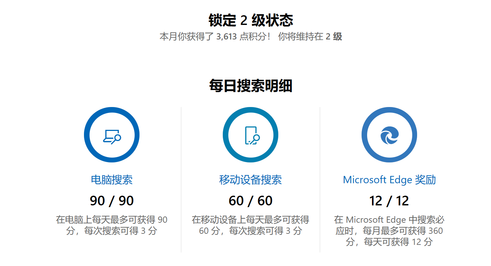
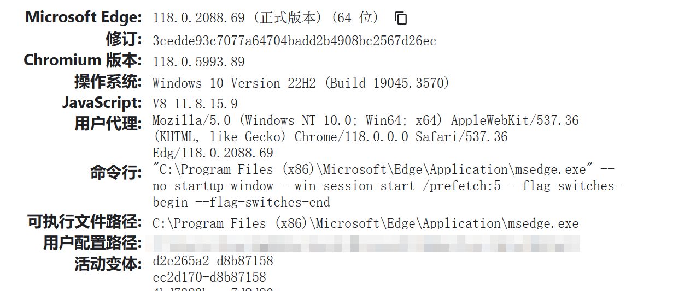

## 微软积分助手（Selenium实现版）
利用Selenium自动搜索获得微软积分，推荐使用Edge作为Selenium的启动浏览器。

### 项目说明
利用Selenium自动搜索来获取微软积分，微软积分查看地址：https://rewards.bing.com/
#### 有什么用？
微软推出了搜索积分机制，每日搜索可以获取一定积分，积分可以用于兑换物品。
(https://rewards.bing.com/redeem/?form=dash_2)
#### 每日积分获取
目前一天可以获取150积分，如果使用Edge浏览器访问还可以额外获得12积分，因此推荐使用Edge浏览器。


### 浏览器Driver安装
Selenium需要安装对应浏览器的driver才能正常启动浏览器。启动项目前请检查是否是否安装了对应浏览器的driver，并且driver的版本号和浏览器的版本号是否一致。
可参考：https://www.jianshu.com/p/5e6f943aadb4

安装好driver后可以将其放到浏览器配置文件夹中，也可以放到项目路径中，推荐放到项目根目录中使用。

#### 用户配置路径查看
需要修改用户配置路径才能正常刷取积分，关于用户配置路径可通过`edge://version`查看，如果是Chrome则通过`chrome://version`查看，其他浏览器请另行寻找查看方式。

用户配置路径为上图中打码位置路径，将其复制并修改到配置文件中使用。

### 配置文件
```toml
[profile]
# 指向你配置文件的路径，使用单引号包裹，这是必需修改项，将复制好的用户配置路径填到这里
path = 'C:\Users\your_user_name\AppData\Local\Microsoft\Edge\User Data\Default'
[search_option]
# 搜索关键字
keywords = [
    "Bocchi the Rock!",
    "Yuzzu Soft",
    "Return to Future: 1999",
    "Yuru Camp",
    "Fly me to the moon",
    "Video killed the radio star"
]
# 基础搜索路径
base_url = "http://cn.bing.com/search?q="
# 是否使用桌面端、移动端访问
pc_on = true
mb_on = true
[loop_time]
# 搜索次数，根据分数上限推导
pc = 30
mb = 20
```

### 不同浏览器适配
项目使用Edge浏览器运行，其他浏览器也支持，不过需要修改源代码。对于Chrome浏览器，需要将`main.py`中

`from selenium.webdriver.edge.options import Options`修改为
`from selenium.webdriver.chrome.options import Options`，

并将`driver = webdriver.Edge(options=options)`修改为`driver = webdriver.Chrome(options=options)`。

同理，对于其他浏览器也是同样。


### 项目运行
推荐使用`anaconda`进行包管理与虚拟环境管理。项目的python版本为`3.8`。
1. `git clone 项目`
2. 激活虚拟环境
3. 安装依赖：`pip install -r requirements.txt` 
4. 按需修改配置文件`conf.toml`